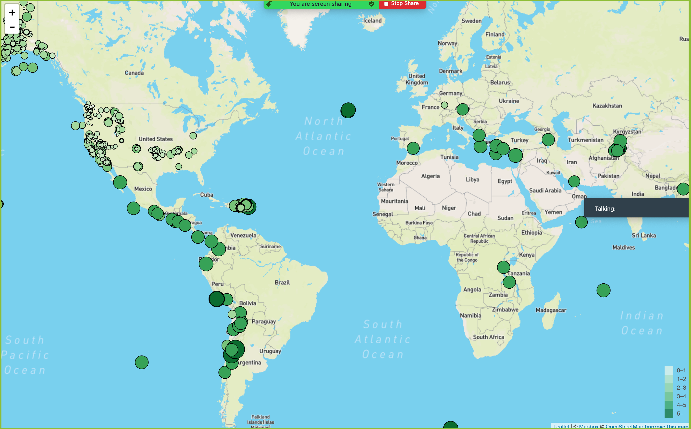

# leaflet-challenge

Welcome to the United States Geological Survey, or USGS for short! The USGS is responsible for providing scientific data about natural hazards, the health of our ecosystems and environment; and the impacts of climate and land-use change. Their scientists develop new methods and tools to supply timely, relevant, and useful information about the Earth and its processes. As a new hire, you will be helping them out with an exciting new project!

The USGS is interested in building a new set of tools that will allow them visualize their earthquake data. They collect a massive amount of data from all over the world each day, but they lack a meaningful way of displaying it. Their hope is that being able to visualize their data will allow them to better educate the public and other government organizations (and hopefully secure more funding..) on issues facing our planet.

After creating and cloning new Repository leaflet-challange new folder Leaflet-Step-1 was created from starter code provided.

All needed files to run html and Javascripts were added by adding extensions to VS.

Step 1 visulize and earthquake data set from website

The USGS provides earthquake data in a number of different formats, updated every 5 minutes. Visit the [USGS GeoJSON Feed](http://earthquake.usgs.gov/earthquakes/feed/v1.0/geojson.php) for data set used in this challenge

Step 2 - Import and Visualize the data
map was created using Leaflet that plots all of th earthquake from data set based on their longitude and latitude.
code was added to style marker in color
code was added to syle the marker in size
code was added to style the markers in shade of colors identifying magnetude
code was added to insert tag including magnitude of earthquake, date and space
code was added to add ledger
